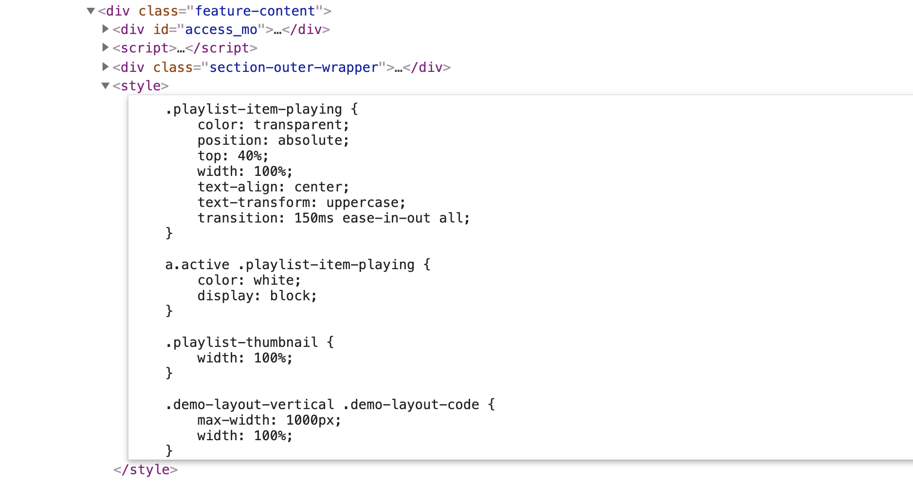

## Discovery - JW Player

The scope of this story is to gain a better understanding of capabilities and integrations needed to implement JW Player on the site.

### Current State of AB x JW Player

AB is using JW Player as both a video player and to host video content via JW Players CDN, see the following links (requires login?) and markup:

[Introduction to US Health Care Providers](https://www.advisory.com/research/health-care-industry-committee/members/resources/2019/introduction-to-us-health-care-providers)

[Everything You Need to Know About Medicare in 13 Minutes](https://www.advisory.com/research/health-care-industry-committee/multimedia/everything-you-need-to-know-about-medicare-in-13-minutes)



...



#### Example of video source link:

https://videos-a.jwpsrv.com/content/conversions/Ao1JBOZN/videos/EHD5VDzg-3206359.mp4-35.ts?hdntl=exp=1571249846~acl=/*~data=hdntl~hmac=b9349a3dbaa7f519ce3c8e1bef5c32d9e784321d201113033dd4e25730886162

Furthermore, there appears to be a script and associated styling placed inline of the markup:

If we are to use JW Player moving forward, any potential development issues should be small (opposed to finding another video player solution and host).

### [JW Player Documentation](https://beta-developer.jwplayer.com/jwplayer/docs)

#### Features of JW Player

* HTML5 Player

* Video Gallery

* Analytics

Styling appears to be loaded with JW Player and not embedded in any of the existing stylesheets provided by the client. The [Player CSS skin reference](https://beta-developer.jwplayer.com/jwplayer/docs/jw8-css-skin-reference) contains all of the information about styling the player.

Playlists are created within the JW Player platform. Playlist information can be [found here in the Player configuration reference playlist section](https://beta-developer.jwplayer.com/jwplayer/docs/jw8-player-configuration-reference#section-playlists)

#### Benefits of (continuing) to use JW Player

* JW Player is the existing player and CDN used by AB

* Extensive [Developer Documentation](https://beta-developer.jwplayer.com/jwplayer/docs)

* Has broad [browser support](https://support.jwplayer.com/articles/browser-support)

##### Potential Video Player Alternatives

As detailed in [this article](https://50wheel.com/top-online-video-platforms-integrate-sitecore/), YouTube, Vimeo, and other free players can be embedded into a Sitecore page with an iframe embed. Platforms such as Brightcove, Kalture, Ooyala, Wistia, and JW Player provide brand-able video players and advanced analytics. [Brightcove even has an OOTB connector for Sitecore](https://support.brightcove.com/getting-started-brightcove-video-connect-sitecore-experience-platform). Here is the [Brightcove Connector for Sitecore 9.0.2](https://github.com/BrightcoveOS/Sitecore-Connector/releases/tag/v9.0.2)

##### Concerns, Blockers, etc...

Using JW Player does not immediately present any concerns, blockers, or challenges. There are no known issues or otherwise to the continued use of JW Player as ABs video player and hosting solution.

### What We Need to Implement JW Player

A log of existing pages where JW Player is currently in use could be helpful, as pages without JW Player hosted videos do not need to load the JavaScript or Stylesheets needed for the player.

Access to AB JW Player account OR set up a [free developer account](https://www.jwplayer.com/pricing/) for development purposes (developer account on JW Player is free for 1 month).

### Sitecore Specific JW Player Links

[Integrating JW Player RTE](https://www.tadigital.com/blog/integrating-jw-player-rich-text-editor/)

Addressing [JW Player causing rendering not to load in Sitecores Page Editor](https://stackoverflow.com/questions/28545873/jwplayer-causes-rendering-not-to-load-in-sitecores-page-editor)

### POC

#### How to install JW Player

[Embedding JW Player](https://support.jwplayer.com/articles/how-to-embed-a-jwplayer)

#### JavaScript for JW Player

[JavaScript API Introduction](https://developer.jwplayer.com/jw-player/docs/developer-guide/api/javascript_api_introduction/)

#### CSS for JW Player

[Customizing JW Player with CSS](https://developer.jwplayer.com/jw-player/docs/developer-guide/customization/css-skinning/skins_example/)

#### HTML for JW Player

[HTML5 JW Player](https://developer.jwplayer.com/jw-player/docs/developer-guide/getting-started/add-an-html5-player/)

#### JW Player Sitecore Integration

There is no OOTB Sitecore Integration for JW Player, the integration will have to be built. There are a couple of links in the 'Sitecore Specific JW Player Links' section that have additional details that may be beneficial.

### TBD

#### UI Considerations

#### Demo

#### Approvals